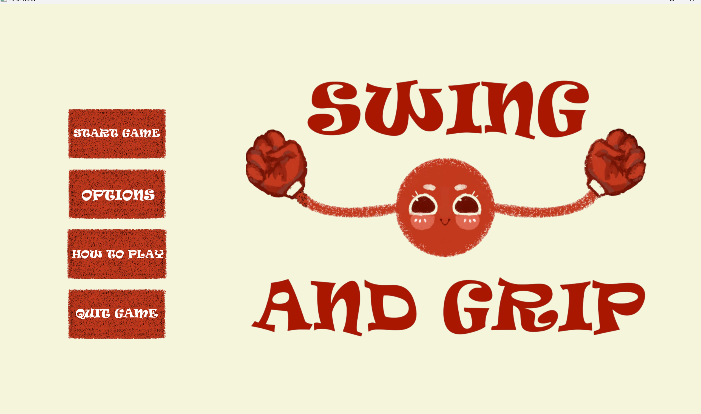

# SWING AND GRIP 
## GIỚI THIỆU GAME
Swing and Grip là một dạng game platformer nhưng khác với những game platformer thông thường, nhân vật di chuyển bằng tay, bám vào các địa hình và đu người bay đến vạch đích để hoàn thành cuộc đua. Tuy nhiên trò chơi này sẽ không hề dễ dàng vì chỉ sơ sẩy một chút thôi bạn sẽ lập tức rơi tự do khỏi địa hình.

Ý tưởng gốc của game: https://www.youtube.com/watch?v=tl07NG4ZY5c&pp=0gcJCdgAo7VqN5tD
- [CÁCH TẢI GAME](#)
- [Bắt đầu game](#)
- [Các thành phần trong game](#)
- [Cách chơi](#)
- [Chiến thắng/Thất bại](#)
- [Đồ họa](#)
- [Source Code](#)

## CÁCH TẢI GAME
## 1. BẮT ĐẦU GAME 

Nhấn vào start game để chơi game. 
## 2. CHỌN NHÂN VẬT 
Người chơi được cho sẵn nhân vật màu đỏ, chơi hết 1 màn sẽ unlock một nhân vật tiếp theo 
 
Sau khi chơi hết màn 1

Sau khi chơi hết màn 2

Sau khi chơi hết màn 3

## 3. CHỌN LEVEL
Có 5 level để chơi với các loại chướng ngại vật khác nhau, phải vượt qua 1 level mới unlock được các level sau, nút back góc trên bên trái có thể back về màn hình trước đó cho bất cứ màn hình nào 

## 4. CÁC CHƯỚNG NGẠI VẬT CÓ THỂ GẶP TRONG GAME
Chướng ngại hình vuông to trong level 1 

Chướng ngại hình vuông bé trong level 2

Chướng ngại hình vuông đen lớn trong level 2

Chướng ngại hình tròn tĩnh và hình tròn di chuyển trong level 3 và level 4 

Chướng ngại hình cột trong level 4 

CHướng ngại gai nhỏ trong level 3, nếu chạm vào sẽ auto respawn tại điểm xuất phát 

Chướng ngại tường gai trong level 3 có thể di chuyển, nếu chạm vào sẽ auto respawn tại điểm xuất phát 

## 4. CÁCH CHƠI

