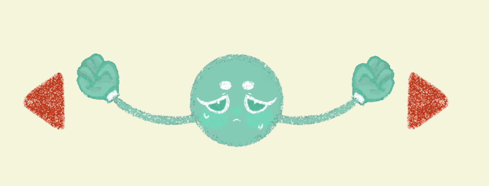
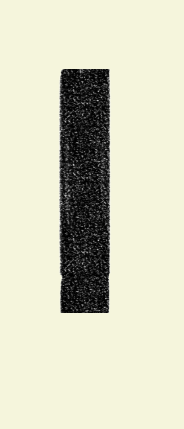

# SWING AND GRIP 

- [GAMEPLAY](#): https://drive.google.com/drive/folders/1G0yIAu0itS8aAqZheoreO1OACEJ8kyN3?usp=drive_link

## GIỚI THIỆU GAME
Swing and Grip là một dạng game platformer nhưng khác với những game platformer thông thường, nhân vật di chuyển bằng tay, bám vào các địa hình và đu người bay đến vạch đích để hoàn thành cuộc đua. Tuy nhiên trò chơi này sẽ không hề dễ dàng vì chỉ sơ sẩy một chút thôi bạn sẽ lập tức rơi tự do khỏi địa hình.

Ý tưởng gốc của game: https://www.youtube.com/watch?v=tl07NG4ZY5c&pp=0gcJCdgAo7VqN5tD
- [1. BẮT ĐẦU GAME](#1-bắt-đầu-game)
- [2. CHỌN NHÂN VẬT](#2-chọn-nhân-vật)
- [3. CHỌN LEVEL](#3-chọn-level)
- [4. CÁC CHƯỚNG NGẠI VẬT CÓ THỂ GẶP TRONG GAME](#4-các-chướng-ngại-vật-có-thể-gặp-trong-game)
- [5. CÁCH CHƠI](#5-cách-chơi)
- [6. CHIẾN THẮNG](#6-chiến-thắng)
- [7. MÃ NGUỒN](#7-mã-nguồn)
- [8. ĐỒ HỌA](#8-đồ-họa)

## CÁCH TẢI GAME
## 1. BẮT ĐẦU GAME 
Nhấn vào start game để chơi game.  

Trong options có thể chỉnh âm lượng.

## 2. CHỌN NHÂN VẬT 

Người chơi được cho sẵn nhân vật màu đỏ, chơi hết 1 màn sẽ unlock một nhân vật tiếp theo 

 

Sau khi chơi hết màn 1

Sau khi chơi hết màn 2

Sau khi chơi hết màn 3

## 3. CHỌN LEVEL

Có 5 level để chơi với các loại chướng ngại vật khác nhau, phải vượt qua 1 level mới unlock được các level sau, nút back góc trên bên trái có thể back về màn hình trước đó cho bất cứ màn hình nào 

## 4. CÁC CHƯỚNG NGẠI VẬT CÓ THỂ GẶP TRONG GAME
Chướng ngại hình vuông to trong level 1 

Chướng ngại hình vuông bé trong level 2

Chướng ngại hình vuông đen lớn trong level 2

Chướng ngại hình tròn tĩnh và hình tròn di chuyển trong level 3 và level 4 

Chướng ngại hình cột trong level 4 

CHướng ngại gai nhỏ trong level 3, nếu chạm vào sẽ auto respawn tại điểm xuất phát 

Chướng ngại tường gai trong level 3 có thể di chuyển, nếu chạm vào sẽ auto respawn tại điểm xuất phát 

## 5. CÁCH CHƠI

Nhấn các phím A, D để nắm vào platform. Khi đó nhân vật đung đưa qua lại như một con. Lúc này có thể dùng các phím mũi tên lên xuống trái phải để hướng nhân vật sang trái, sang phải, lên trên, xuống dưới. Nếu muốn di chuyển từ platform này sang platform kia cần dùng các phím mũi tên để lấy đà cho phù hợp. Mục đích là đi đến đích. Nếu thả tay giữa chừng mà đang lơ lửng sẽ rơi tự do và respawn.

## 6. CHIẾN THẮNG

Sau mỗi màn chơi sẽ có thông báo chúc mừng hoàn thành màn. 

Sau khi hoàn thành cả 5 màn sẽ chiến thắng.

## 7. MÃ NGUỒN

- [Folder main](#) : quản lí vòng lặp chính, event, các sự kiện trong các level
- [Folder music](#) : quản lí những thứ liên quan đến âm thanh
- [Folder defs](#) : quản lí các biến tĩnh
- [Folder menupanel](#) : quản lí màn hình menu
- [Folder graphic](#) : core của game, quản lí khởi tạo nhân vật, platform và cách di chuyển của nhân vật

## 8. ĐỒ HỌA

Nằm trong file graphic, tất cả được vẽ tay

